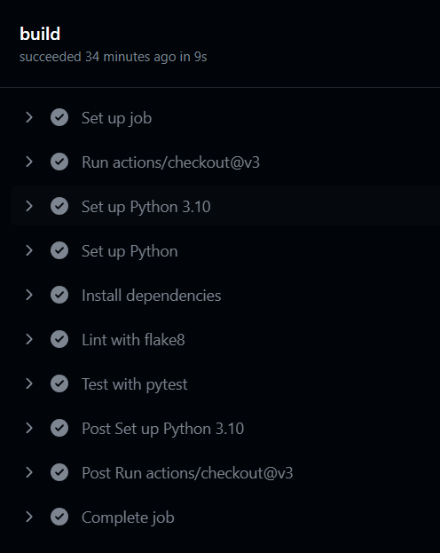

# Copy in local
    git clone https://github.com/amirulashrafazahar/WebGuard.git

# Activate env
    myvenv\Scripts\activate

# Run the app
    python -m flask run

# i use https://www.pythonanywhere.com/ to make url public for github to scan
# target scan : https://amirul.pythonanywhere.com

# There are few things we can improve :
# 1. there is an issue with getting the scan result to an artifact in Github Action but the scan itself is a success here 
# 2. We can also create rules.tsv file to defines the rules that ZAP should follow during the scan

# Example rules.tsv
ID    Name    Enabled    Risk    Description
1000  SQL Injection - MySQL    true    High    Looks for SQL Injection vulnerabilities specific to MySQL databases
1001  SQL Injection - Oracle   true    High    Looks for SQL Injection vulnerabilities specific to Oracle database

# What has been achieved here : 
# 1. Git repository (public or private, your choice) for the WebGuard web application.
# 2. Simple Flask web application running in Github action pipeline
# 3. Automated unit test running in the pipeline
# 4. Automated security scanning with OWASP ZAP

# not able to integrate with Heroku got issue with signup

